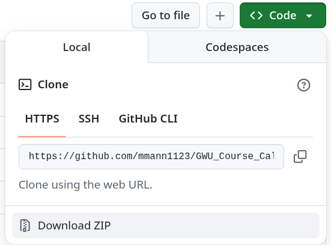

# GWU Course Calendar Scraper

An easy-to-use application that creates a beautiful Google Calendar-style view of GWU course schedules.


## What Does This Do?

This app fetches course information from GWU's website and displays it in an interactive weekly calendar. You can:
- See all courses for any subject in a visual weekly layout
- Click on courses to view details (instructor, room, CRN, etc.)
- View overlapping courses side-by-side
- Export course data for further use

---

## Getting Started (3 Easy Steps!)

### Step 1: Install Python

#### **Windows Users**
1. Open the **Microsoft Store** (search for it in the Start menu)
2. Search for **"Python"**
3. Install **Python 3.12** (or the latest version)
4. That's it! Python is now installed.

#### **Mac Users**
1. Open **Terminal** (find it in Applications → Utilities)
2. Install Homebrew (if you don't have it) by pasting this command:
   ```bash
   /bin/bash -c "$(curl -fsSL https://raw.githubusercontent.com/Homebrew/install/HEAD/install.sh)"
   ```
3. Install Python by typing:
   ```bash
   brew install python
   ```

#### **Linux Users**
Python is usually already installed! To check, open Terminal and type:
```bash
python3 --version
```
If you don't have it, install it with:
```bash
sudo apt install python3 python3-pip    # Ubuntu/Debian
sudo dnf install python3 python3-pip    # Fedora
```

---

### Step 2: Download This Project


1. Click the green **"Code"** button at the top of this page
2. Click **"Download ZIP"**
3. Unzip the file to a folder on your computer (like your Desktop or Documents)

---

### Step 3: Run the Application

#### **Windows Users**
1. Open the folder where you unzipped the files
2. **Double-click** on `launch_gui.bat`
3. Run despite warning
4. A window will open - that's the app!

#### **Mac/Linux Users**
1. Open **Terminal**
2. Navigate to the folder where you unzipped the files:
   ```bash
   cd ~/Desktop/GWU_Course_Calendar
   ```
   (Replace `~/Desktop/` with wherever you saved it)
3. Make the launcher executable (only need to do this once):
   ```bash
   chmod +x launch_gui.sh
   ```
4. Run the application:
   ```bash
   ./launch_gui.sh
   ```

---

## Using the Application

Once the app opens, you'll see a simple interface:

1. **Select Year**: Choose the academic year
2. **Select Semester**:
   - Spring 01
   - Summer 02
   - Fall 03
3. **Enter Subject Code**: Type the 4-letter subject code (e.g., GEOG, CSCI, MATH, BADM)
4. **Click "Start Scraping"**

The app will:
- Fetch all courses for that subject
- Show progress in real-time
- Generate an interactive calendar HTML file
- Automatically open it in your web browser!

### Common Subject Codes
- `GEOG` - Geography
- `CSCI` - Computer Science
- `MATH` - Mathematics
- `BADM` - Business Administration
- `PSYC` - Psychology
- `ECON` - Economics
- `PSC` - Political Science
- `HIST` - History
- `ENGL` - English

---

## Output Files

The app creates two files:

### 1. `gwu_course_calendar.html`
**This is your interactive calendar!** Open it in any web browser to see:
- Weekly view with all courses laid out by day and time
- Click any course for details (CRN, instructor, location, credits)
- Works offline - no internet needed once created

### 2. `gwu_course_calendar.json`
Raw course data in JSON format. Useful if you want to analyze the data yourself or import it into other tools.

---

## Troubleshooting

### "Python is not recognized" or "command not found"
- **Windows**: Restart your computer after installing Python from the Microsoft Store
- **Mac/Linux**: Make sure Python is installed (try `python3 --version` in Terminal)

### The terminal window closes immediately
- **Windows**: Make sure you're double-clicking `launch_gui.bat` (not `launch_gui.sh`)
- **Mac/Linux**: Make sure you're running `./launch_gui.sh` (not `launch_gui.bat`)

### "No module named 'tkinter'" error
- **Mac**: Run `brew install python-tk`
- **Linux**: Run `sudo apt install python3-tk` (Ubuntu/Debian)

### No courses found
- Check your internet connection
- Verify the subject code is correct (must be 4 letters)
- Make sure the semester/year combination is valid (courses might not be posted yet)

### The app installed missing packages automatically
- This is normal! The first time you run it, the app will install BeautifulSoup and Requests
- This only happens once

---

## Tips

- **Save calendars for multiple subjects**: Run the app multiple times with different subject codes
- **Change the output filename**: In the app, edit the "Output Filename" field before scraping
- **Share calendars**: The HTML file can be emailed or shared - it works on any device with a web browser
- **Print your schedule**: Open the HTML file and print from your browser

---

## What's Inside?

- `gwu_scraper_gui.py` - Graphical interface (easy to use)
- `gwu_scraper.py` - Command-line version (for advanced users)
- `launch_gui.bat` - Windows launcher
- `launch_gui.sh` - Mac/Linux launcher
- `requirements.txt` - List of required Python packages (automatically installed)

---

## Features

✅ **Easy to Use**: Graphical interface - no coding required
✅ **Automatic Installation**: Installs needed packages automatically
✅ **Interactive Calendar**: Google Calendar-style weekly view
✅ **Overlap Detection**: Shows overlapping courses side-by-side
✅ **Complete Data**: CRN, instructor, time, location, credits, and status
✅ **Cross-platform**: Works on Windows, Mac, and Linux
✅ **No Internet Needed**: Once created, the calendar works offline

---

## For Advanced Users

### Command-Line Usage

If you prefer the command line:

```bash
# Default: Scrape Geography courses for current term
python gwu_scraper.py

# Scrape specific subject
python gwu_scraper.py --url "https://my.gwu.edu/mod/pws/courses.cfm?campId=1&termId=202601&subjId=CSCI"

# Custom output filename
python gwu_scraper.py --output my_calendar.html --json my_data.json

# Show all options
python gwu_scraper.py --help
```

---

## License

MIT License - See [LICENSE](LICENSE) file for details.

This tool is provided as-is for educational purposes. Please use responsibly and in accordance with GWU's terms of service.

---

## Need Help?

1. Read the **Troubleshooting** section above
2. Check that Python is installed: Open Terminal/Command Prompt and type `python --version`
3. Make sure you're using the right launcher file (`.bat` for Windows, `.sh` for Mac/Linux)

**Have fun exploring GWU courses!** 🎓
